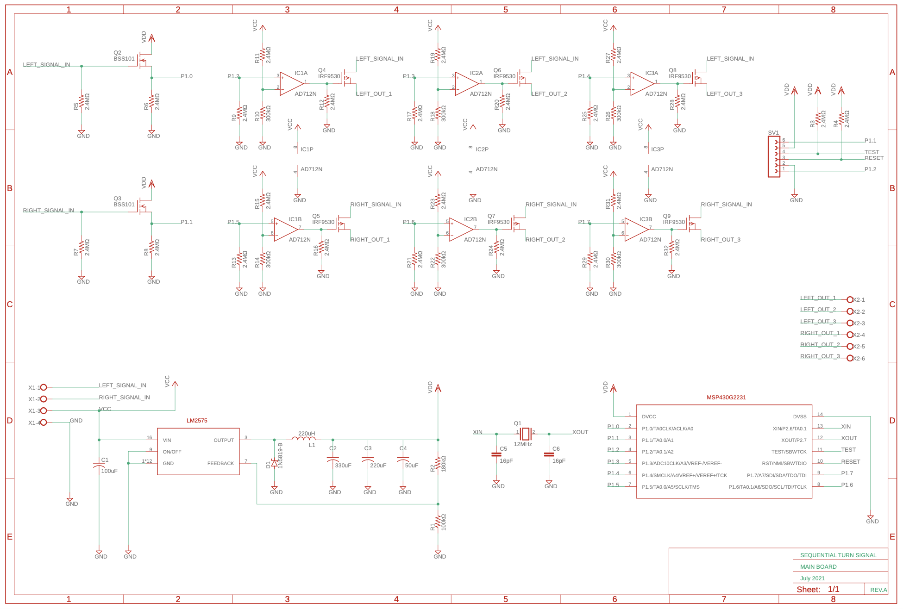
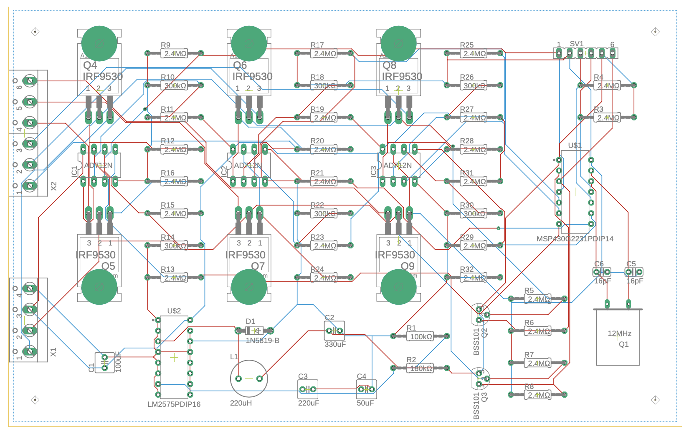
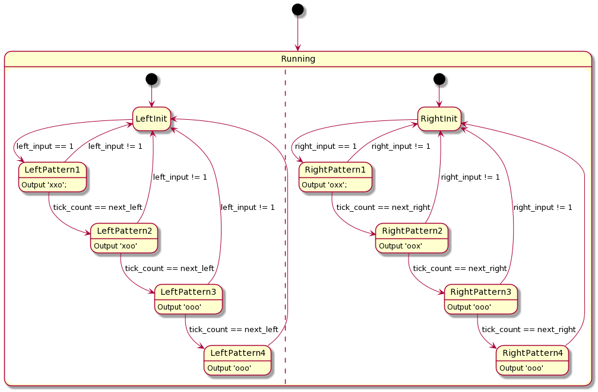
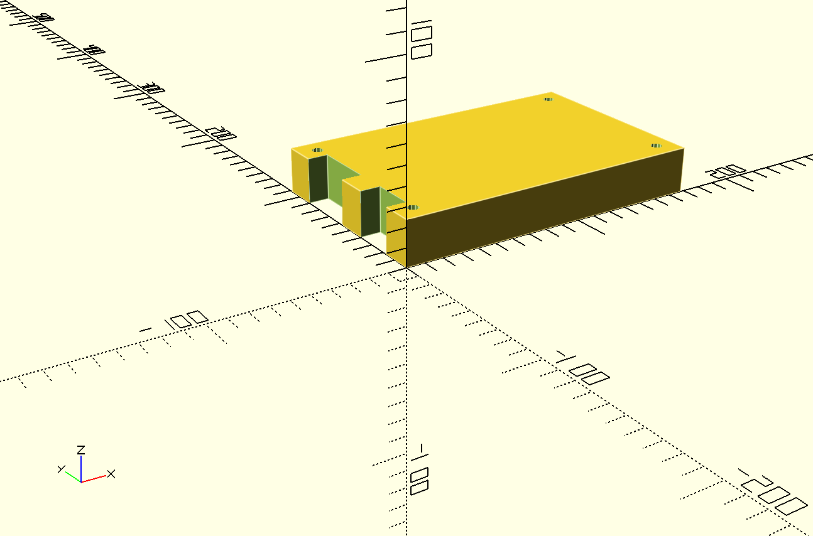
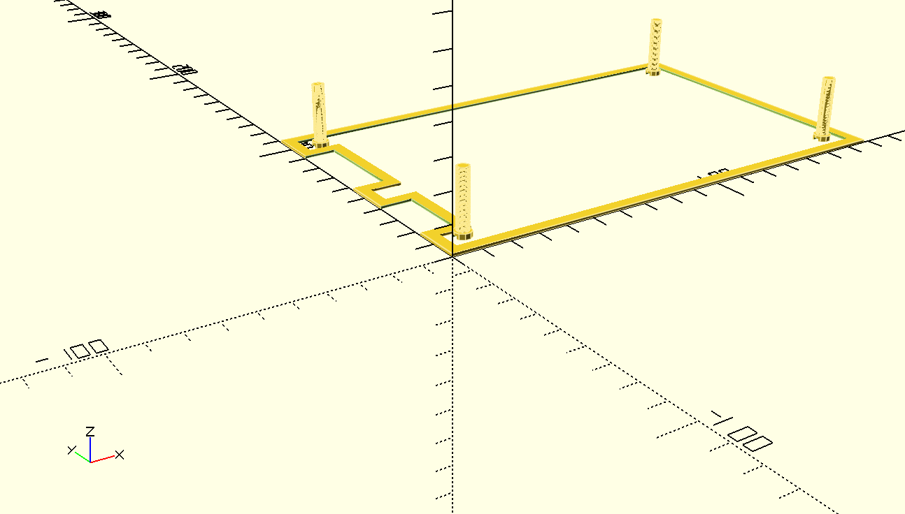
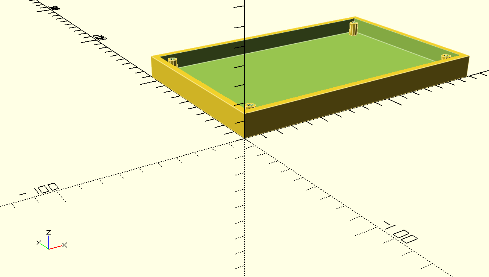
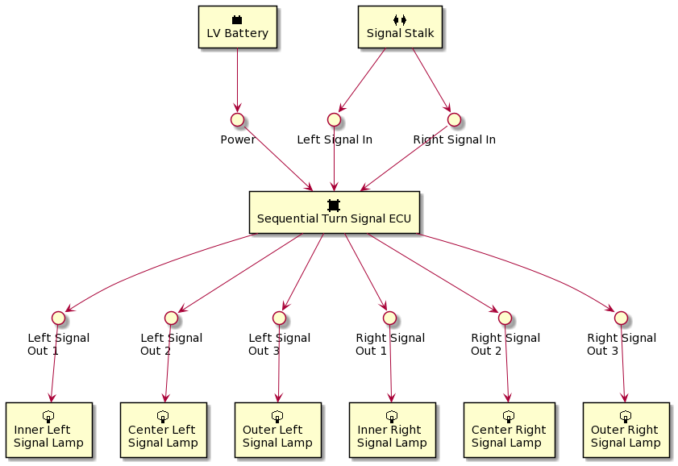

# Clignotant Séquentiel

## Introduction
Dans les véhicules modernes les clignotants séquentiels s'accroissent rapidement
leur popularité.  Un clignotant séquentiel est un clignotant lequel est divisé
en segments plusiers que s'éclairent en motif dynamique quand le clignotant est
activé.  Tandis que cette fonctionnalité est déjà inclus en beaucoup des
véhicules modernes, ce project cherche à fournir une méthode simple pour
introduire cette fonctionnalité en voitures classiques sans la besoin de
remplacer tous les feux clignotants originals.  Le logiciel et le matériel sont
configurés par défaut pour un véhicule avec trois feux clignotants arrières
indépendants de chaque côté du véhicule, mais il peut être adapté pour autres
configurations s'il est nécessaire.

Si vous planifiez installer ce système dans votre véhicule, s'il vous plaît
lisez ce guide entièrement et comprenez vous aurez besoin de quels outils et
compétences avant de commencer.  Un niveau élevé d'expérience automobile et
électronique est recommandé comme ce système n'a pas été testé dans un
environnement opérationnel.  En outre, il est conçu pour un véhicule spécifique
et peut-être modifications seront requis si vous voudriez l'utiliser dans un
autre.

S'il vous plaît vérifiez les réglementations locales concernant modifications
aux véhicules avant de commencer.  Ce système aussi introduira le comportement
séquentiel au début de l'éclairage des feux stop, lequel est peut-être ou
pas peut-être légal dans votre jurisdiction.  Aditionellement s'il vous plaît
comprenez les risques à vous-même, à votre véhicule, et aux autres gens avec qui
vous partagez la route.  Ces incluent, mais ne sont pas limités à la
électrocution, au feu, à ruinant le faisceau de câblage de votre véhicule, et
à finissant avec un véhicule que n'a pas des feux clignotants ou des feux stop
fonctionnels.  Procédez à votre risque.

## Construire le Système
Ce système est composé de trois composants: un circuit imprimé avec le
microcontrôleur et l'électronique; le micrologiciel, lequel exécute dans le
microcontrôleur; et un boîtier pour offrir de protection à les composants
fonctionnels du système.  Chacun des sections suivantes contient plus de détails
sur chaque composant, comment le construire, et des modifications possibles.

### Circuit Imprimé

Le diagramme schématique et le circuit imprimé ont été créés avec
[EAGLE](https://www.autodesk.com/products/eagle/overview?term=1-YEAR).  Le
projet peut être chargé des fichiers dans le répertoire 'pcb' de ce dépôt.
Voici les étapes pour le construire:
1. Utilisez EAGLE à exporter les fichiers Gerber du fichier main.brd.  Vous
  pouvez suivre [ces instructions](https://www.autodesk.com/products/eagle/blog/gerber-nc-drill-pcb-manufacturing-basics-1/)
  d'Autodesk.
2. Trouvez un fabricant des circuits imprimés et les envoyez les fichiers Gerber
  et les fichiers Excellon pour fabrication.
3. Vous devez recevoir un circuit imprimé vide du fabricant.  Tous les
  composants ont été sélectionnés comme les composants de trou traversant pour
  faire l'assemblage chez vous plus facile.  Vous aurez besoin d'acheter tous
  les composants par numéro de modèle comme il est montré dans le diagramme
  schématique.
4. Soudez les composants au circuit imprimé.

Des choses à considérer:
1. Ce circuit imprimé intercepte les lignes clignotants droit et gauche et les
  divise en trois lignes de signal pour chaque lampe individuelle.  Supposant
  lampes de stop de 30 watts, quelques traces porteront jusqu'à 2.5 ampères,
  alors s'il est possible il est recommandé à élargir ces traces pour réduire
  leurs résistances et atténuer le risque d'échec thermique du circuit imprimé.
2. Les connecteur pour l'alimentation, la terre, l'entrée, et la sortie ne sont
  pas de qualité automobile.  Ils ont été sélectionnés comme connecteurs de vis
  pour faire la débogage plus facile.  Ces doivent être remplacés avec des
  connecteurs appropriés s'il est possible.
3. Le circuit imprimé contient l'espace suffisant pour un inducteur toroïdal
  pour l'alimentation à découpage.  Si vous planifiez en faisant votre propre
  inducteur, vous pouvez calculer le numéro de tours requis en utilisant
  [ce guide](http://www.nessengr.com/technical-data/toroid-inductor-formulas-and-calculator/).
  Rappelez-vous choisir un fil suffisamment large pour soutenir jusqu'à 1
  ampère.

### Logiciel

Le composant logiciel est composé de deux automates fini lesquels exécutent sur
un microcontrôleur MSP430.  Il y a un automate fini pour chaque clignotant:
lorsque la ligne du signal de l'entrée va à l'haute, l'automate fini commence à
traverser les vecteurs du motif de la sortie avec transitions basé sur temps.
Une fois que la ligne du signal de l'entrée va à la basse, l'automate fini se
réinitialise.

Le logiciel a été créé avec le [Code Composer Studio](https://www.ti.com/tool/CCSTUDIO)
de TI. Vous pouvez charger le projet avec les fichiers dans le répertoire
'firmware' de ce dépôt.  Voici les étapes pour compiler le micrologiciel et le
charger sur le circuit imprimé:
1. Achetez un [programmeur MSP430](https://www.ti.com/tool/MSP-FET).
2. Ouvrez le project de Code Composer Studio dans le répertoire 'firmware' de ce
  dépôt.
3. Connectez le programmeur au connecteur de débogage du circuit imprimé.  Le
  connecteur de débogage du circuit imprimé est conçu pour communiquer avec le
  programmeur en utilisant SBW et UART.
4. Suivez les instructions dans le [manuel de Code Composer Studio](https://www.ti.com/lit/ug/spru509h/spru509h.pdf)
  pour charger le micrologiciel au appareil.
5. Quand le pouvoir est introduit dans l'entrée de l'alimentation 12 V du
  circuit imprimé, le MSP430 devrait se démarrer.  Vous pouvez vérifier le
  fonctionnalité en fournissant 12 V à chacun des entrées des clignotants gauche
  ou droit et en surveillant les tensions sur les goujons de sortie.

Des choses à considérer:
1. Vous pouvez définir motifs à la mode en utilisant les macros à la tête du
  fichier main.c.
2. Vous pouvez accélérer ou ralentir le motif séquentiel en changeant la
  définition de TIMER_RESOLUTION_TICKS dans main.c.
3. La version du MSP430 laquelle est utilisée en ce projet seulement a un port
  8-bit.  Si votre véhicule a plus que six lampes individuelles (3 par côté)
  qu'ont besoin d'être contrôlées, vous aurez besoin de sélectionner un
  microcontrôleur différent et repenser le circuit imprimé.

### Boîtier

Le boîtier a été conçu avec [OpenSCAD](https://openscad.org/).  Ceci n'est pas
une conception imperméable et le but est apporter un niveau minimum de
protection pour le circuit imprimé.  Comme tel, il est recommandé à installer le
boîtier dans l'intérieur du véhicule.

Les dessins de CAO du boîtier sont proposés comme un guide approximatif.  Vous
pouvez usiner votre propre boîtier de métal basé sur les dessins ou les
convertir en fichiers de STL et imprimer en 3D les pièces.  Si le boîtier est
imprimé en 3D, s'il vous plaît vous assurez que vous utilisiez un plastique que
puisse résister les extrêmes thermiques qu'on peut trouver dans un véhicule.

## Installation du Système

Le système a les connexions suivantes avec le câblage du véhicule:
* **Pouvoir** - 12 V de la pile de basse tension du véhicule.  Idéalement ce
  devrait venir d'une ligne laquelle est haute lorsque le véhicule a besoin du
  système et basse lorsque le véhicule est stationné pour longtemps.  C'est
  parce que le microcontrôleur fonctionnera quand la tension est fournie à cette
  entrée et pourrait drainer la pile si le véhicule reste stationné pour
  longtemps.
* **Terre** - La terre du véhicule; ceci peut être rattachée au châssis du
  véhicule.
* **Entrée de clignotant droit** - La ligne 12 V originalement au clignotant
  droit du véhicule.
* **Entrée de clignotant gauche** - La ligne 12 V originalement au clignotant
  gauche du véhicule.
* **Sortie de clignotant droit 1** - Le lien entre le système et la lampe de
  clignotant droit arrière de dedans.
* **Sortie de clignotant droit 2** - Le lien entre le système et la lampe de
  clignotant droit arrière du milieu.
* **Sortie de clignotant droit 3** - Le lien entre le système et la lampe de
  clignotant droit arrière d'extérieur.
* **Sortie de clignotant gauche 1** - Le lien entre le système et la lampe de
  clignotant gauche arrière de dedans.
* **Sortie de clignotant gauche 2** - Le lien entre le système et la lampe de
  clignotant gauche arrière du milieu.
* **Sortie de clignotant gauche 3** - Le lien entre le système et la lampe de
  clignotant gauche arrière d'extérieur.
